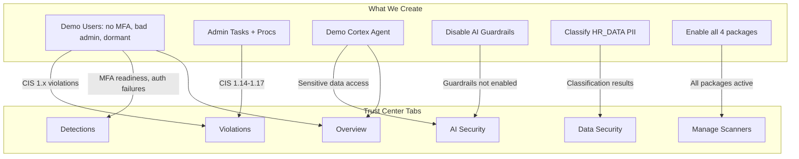

# Build Trust Center Violations — Full Population

## Goal

Populate every Trust Center tab so the demo shows a rich, realistic security posture. Each tab must have visible, meaningful content.

## Trust Center Tab Coverage



### Tab 1: Overview
Populated automatically from findings across all packages. Requires all 4 scanner packages enabled and producing findings.

### Tab 2: Violations (CIS Compliance)
CIS Benchmarks = the compliance framework. Need findings across all CIS sections:

| CIS Section | What It Covers | How to Trigger |
|-------------|---------------|----------------|
| Section 1 (Identity) | MFA, SSO, SCIM, passwords, admin roles, dormant users | Create DEMO_ users without MFA, with admin default roles, dormant |
| Section 2 (Monitoring) | Checks that TI/SE scanners are enabled and have recent findings | Enable Threat Intelligence package (resolves some 2.x violations but validates monitoring) |
| Section 3 (Network) | Network policies | Already have CIS 3.1 Critical (no account-level policy) |
| Section 4 (Data) | Encryption, retention, masking, row-access, stages | Already have findings; classification + masking gaps add to these |

### Tab 3: Detections
Requires event-driven findings. Sources:
- **Security Essentials**: Client Application Security Risks (already have HIGH + MEDIUM detections)
- **Threat Intelligence**: Event-driven scanners (Login Protection, Dormant User Login, Auth Policy Changes, Sensitive Parameter Protection)
- **AI Security**: Sensitive Data Accessed by Agent (detection type)

To trigger more detections: Create the demo agent that accesses classified data, and the scheduled TI scanners will produce detection-type findings for unusual apps, long-running queries, etc.

### Tab 4: Data Security
The classification dashboard. Must show:
- Classified tables with semantic/privacy tags
- Classification results

Action: Run `EXTRACT_SEMANTIC_CATEGORIES` + `ASSOCIATE_SEMANTIC_CATEGORY_TAGS` on HR_DATA to populate this tab.

### Tab 5: AI Security
Has 3 status cards + violations/detections charts:
- **AI Agents card**: Shows 35+ agents (already exist)
- **AI Security Scanners card**: Shows 4/4 enabled (need to enable package)
- **Cortex AI Guardrails card**: Shows NOT configured (need to disable guardrails)
- **Violations chart**: Guardrails not enabled, Search privileged roles, Cortex Code PAT
- **Detections chart**: Sensitive data accessed by agent

### Tab 6: Manage Scanners
Shows all 4 packages. Need all enabled:
- Security Essentials: Already enabled
- CIS Benchmarks: Already enabled
- AI Security: Currently disabled — enable
- Threat Intelligence: Currently disabled — enable

## Implementation

### File 1: `5_demo_violations_setup.sql`

```sql
USE ROLE ACCOUNTADMIN;

-- =============================================
-- SECTION 1: INSECURE USERS (CIS + TI + SE)
-- =============================================

-- No MFA user (CIS 1.4 Critical, TI MFA Readiness Critical, SE Strong Auth)
CREATE USER IF NOT EXISTS DEMO_NO_MFA_USER
  TYPE = PERSON
  PASSWORD = 'Demo!Pass2026x'
  MUST_CHANGE_PASSWORD = FALSE;

-- Admin without email, admin default role
-- (CIS 1.11 no email, CIS 1.12 admin default, CIS 1.10 too many admins)
CREATE USER IF NOT EXISTS DEMO_BAD_ADMIN
  TYPE = PERSON
  PASSWORD = 'Admin!Pass2026x'
  MUST_CHANGE_PASSWORD = FALSE
  DEFAULT_ROLE = ACCOUNTADMIN;
GRANT ROLE ACCOUNTADMIN TO USER DEMO_BAD_ADMIN;

-- Dormant user (CIS 1.8 inactive 90 days)
CREATE USER IF NOT EXISTS DEMO_DORMANT_USER
  TYPE = PERSON
  PASSWORD = 'Dormant!2026x'
  MUST_CHANGE_PASSWORD = FALSE
  DISABLED = TRUE;

-- Over-privileged role (CIS 1.13)
CREATE ROLE IF NOT EXISTS DEMO_OVERPRIVILEGED_ROLE;
GRANT ROLE ACCOUNTADMIN TO ROLE DEMO_OVERPRIVILEGED_ROLE;

-- =============================================
-- SECTION 2: ADMIN-PRIVILEGED OBJECTS (CIS 1.14-1.17)
-- =============================================

CREATE OR REPLACE TASK DEMO_DB.PUBLIC.DEMO_ADMIN_TASK
  WAREHOUSE = COMPUTE_WH
  SCHEDULE = '1440 MINUTE'
AS SELECT 1;

CREATE OR REPLACE PROCEDURE DEMO_DB.PUBLIC.DEMO_ADMIN_PROC()
  RETURNS STRING LANGUAGE SQL EXECUTE AS OWNER
AS 'SELECT ''admin proc''';

-- =============================================
-- SECTION 3: DISABLE AI GUARDRAILS (AI Security)
-- =============================================
-- Currently enabled. Disabling so scanner flags it as violation.

ALTER ACCOUNT UNSET AI_SETTINGS;

-- =============================================
-- SECTION 4: CORTEX SEARCH + AGENT OVER CLASSIFIED DATA
-- =============================================
-- Creates a search service over HR_DATA (which has PII)
-- and an agent that uses it — triggers AI_SECURITY_AGENT_SENSITIVE_DATA_ACCESS

CREATE OR REPLACE CORTEX SEARCH SERVICE DEMO_DB.PUBLIC.DEMO_HR_SEARCH
  ON EMAIL_ADDRESS
  WAREHOUSE = COMPUTE_WH
  TARGET_LAG = '1 day'
  AS (SELECT * FROM DEMO_DB.PUBLIC.HR_DATA);

CREATE OR REPLACE AGENT DEMO_DB.PUBLIC.DEMO_INSECURE_AGENT
  COMMENT = 'Demo agent accessing classified HR data without guardrails'
  FROM SPECIFICATION
  $$
  models:
    orchestration: auto
  instructions:
    response: "Answer questions about HR employee data"
  tools:
    - tool_spec:
        type: "cortex_search"
        name: "HRSearch"
        description: "Search HR employee records including PII"
  tool_resources:
    HRSearch:
      search_service: "DEMO_DB.PUBLIC.DEMO_HR_SEARCH"
      max_results: "5"
  $$;

-- =============================================
-- SECTION 5: CLASSIFY HR_DATA (Data Security tab)
-- =============================================

CALL ASSOCIATE_SEMANTIC_CATEGORY_TAGS(
    'DEMO_DB.PUBLIC.HR_DATA',
    EXTRACT_SEMANTIC_CATEGORIES('DEMO_DB.PUBLIC.HR_DATA')
);

-- =============================================
-- SECTION 6: ENABLE ALL SCANNER PACKAGES
-- =============================================

CALL snowflake.trust_center.set_configuration('ENABLED', 'TRUE', 'AI_SECURITY', false);
CALL snowflake.trust_center.set_configuration('ENABLED', 'TRUE', 'THREAT_INTELLIGENCE', false);

-- =============================================
-- SECTION 7: RUN ALL SCANNERS
-- =============================================

CALL snowflake.trust_center.execute_scanner('CIS_BENCHMARKS');
CALL snowflake.trust_center.execute_scanner('SECURITY_ESSENTIALS');
CALL snowflake.trust_center.execute_scanner('AI_SECURITY');
CALL snowflake.trust_center.execute_scanner('THREAT_INTELLIGENCE');
```

### File 2: `6_demo_violations_teardown.sql`

```sql
USE ROLE ACCOUNTADMIN;

-- Drop demo users
DROP USER IF EXISTS DEMO_NO_MFA_USER;
DROP USER IF EXISTS DEMO_BAD_ADMIN;
DROP USER IF EXISTS DEMO_DORMANT_USER;

-- Drop demo role
DROP ROLE IF EXISTS DEMO_OVERPRIVILEGED_ROLE;

-- Drop demo objects
DROP TASK IF EXISTS DEMO_DB.PUBLIC.DEMO_ADMIN_TASK;
DROP PROCEDURE IF EXISTS DEMO_DB.PUBLIC.DEMO_ADMIN_PROC();

-- Drop demo agent and search service
DROP AGENT IF EXISTS DEMO_DB.PUBLIC.DEMO_INSECURE_AGENT;
DROP CORTEX SEARCH SERVICE IF EXISTS DEMO_DB.PUBLIC.DEMO_HR_SEARCH;

-- Re-enable AI Guardrails
ALTER ACCOUNT SET AI_SETTINGS = $$
  guardrails:
    advanced_prompt_injection:
      - enabled: true
$$;

-- Remove classification tags from HR_DATA
ALTER TABLE DEMO_DB.PUBLIC.HR_DATA MODIFY COLUMN EMAIL_ADDRESS UNSET TAG SNOWFLAKE.CORE.SEMANTIC_CATEGORY;
ALTER TABLE DEMO_DB.PUBLIC.HR_DATA MODIFY COLUMN EMAIL_ADDRESS UNSET TAG SNOWFLAKE.CORE.PRIVACY_CATEGORY;
ALTER TABLE DEMO_DB.PUBLIC.HR_DATA MODIFY COLUMN FNAME UNSET TAG SNOWFLAKE.CORE.SEMANTIC_CATEGORY;
ALTER TABLE DEMO_DB.PUBLIC.HR_DATA MODIFY COLUMN FNAME UNSET TAG SNOWFLAKE.CORE.PRIVACY_CATEGORY;
ALTER TABLE DEMO_DB.PUBLIC.HR_DATA MODIFY COLUMN LNAME UNSET TAG SNOWFLAKE.CORE.SEMANTIC_CATEGORY;
ALTER TABLE DEMO_DB.PUBLIC.HR_DATA MODIFY COLUMN LNAME UNSET TAG SNOWFLAKE.CORE.PRIVACY_CATEGORY;
ALTER TABLE DEMO_DB.PUBLIC.HR_DATA MODIFY COLUMN AGE UNSET TAG SNOWFLAKE.CORE.SEMANTIC_CATEGORY;
ALTER TABLE DEMO_DB.PUBLIC.HR_DATA MODIFY COLUMN AGE UNSET TAG SNOWFLAKE.CORE.PRIVACY_CATEGORY;

-- Disable AI Security and Threat Intelligence (for repeatable demo)
CALL snowflake.trust_center.set_configuration('ENABLED', 'FALSE', 'AI_SECURITY', false);
CALL snowflake.trust_center.set_configuration('ENABLED', 'FALSE', 'THREAT_INTELLIGENCE', false);
```

## Expected Findings by Tab

| Tab | Content |
|-----|---------|
| **Overview** | Summary cards showing Critical/High/Medium/Low counts across all packages |
| **Violations** | CIS 1.4 (MFA Critical), CIS 3.1 (Network Critical), CIS 1.10-1.17 (admin), AI Guardrails (High), Search Privileged Roles (High), Cortex Code PAT (High), 40+ total violations |
| **Detections** | Client Security (SE), Sensitive Data by Agent (AI Security), Auth events (TI event-driven), Long-running queries (TI) |
| **Data Security** | HR_DATA classified with email, name, age tags visible in dashboard |
| **AI Security** | 36+ agents, 4/4 scanners enabled, guardrails NOT configured (flagged), violations + detections charts populated |
| **Manage Scanners** | All 4 packages enabled: Security Essentials, CIS Benchmarks, AI Security, Threat Intelligence |

## Critical Files

- `5_demo_violations_setup.sql` — Creates all violations, classifies data, enables packages, runs scanners
- `6_demo_violations_teardown.sql` — Cleans up everything including re-enabling guardrails
- `1_demo_setup.sql` — Updated to call violations setup
- `3_demo_trust_center.sql` — Demo script (minor updates for guardrails remediation story)
