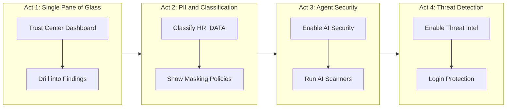

# Trust Center Demo Plan

## Account State (SFSEEUROPE-COLM_USWEST)

### Currently Enabled
- **CIS Benchmarks** — 45 scanners, all enabled. Active critical findings (3.1 network policy, 1.4 MFA).
- **Security Essentials** — 8 scanners, all enabled. Findings on MFA, client security, org user domains.

### Currently Disabled (to enable as part of demo)
- **AI Security** — 4 scanners: prompt injection guardrails, agent sensitive data access, Cortex Search privileged roles, Cortex Code PAT usage.
- **Threat Intelligence** — 22 scanners including Login Protection (malicious IPs), Dormant User Login, Auth Failures, Sensitive Parameter Protection, Authentication Policy Changes.

### PII / Classification Assets
- `DEMO_DB.PUBLIC.HR_DATA` — 4 columns (AGE, EMAIL_ADDRESS, FNAME, LNAME). Already has one `SEMANTIC_CATEGORY=email` tag on EMAIL_ADDRESS. Good candidate for live classification demo.
- `RBAC_DEMO_DB.ANALYST_DATA.STOCK_ANALYST_DATA` — 16 columns with masking policies already applied to ANALYST_NAME, ANALYST_EMAIL, ANALYST_PHONE, PRICE_TARGET, CONFIDENTIAL_NOTES. Perfect for showing "what good looks like" after classification + masking.
- `EXTRACT_SEMANTIC_CATEGORIES` function is available for live classification.
- CIS 4.10 (masking) and 4.11 (row access policies) findings are open — ties Trust Center findings to the data protection story.

## Demo Flow (~8 minutes)

### Act 1: Trust Center Overview (Snowsight UI, ~2 min)
*Ties to Slide 3 (centralised visibility) and Slide 5 (Trust Center)*

1. Open Trust Center in Snowsight — show the dashboard with severity distribution
2. Point out: CIS Benchmarks and Security Essentials are active, AI Security and Threat Intelligence are not yet — "we'll fix that"
3. Drill into CIS 3.1 (Critical: no account-level network policy) — show 10 at-risk entities, the suggested remediation SQL
4. Show CIS 1.14/1.15 (High: tasks/procs with admin roles) — "41 tasks running with ACCOUNTADMIN. That's exactly the kind of over-privileged access we were just talking about"
5. Transition: "But what about protecting the data itself? Let's look at classification."

### Act 2: PII Classification and Data Protection (SQL worksheet, ~2 min)
*Ties to Slide 4 (data security layer — sensitive data protection)*

6. **Run classification on HR_DATA** — `SELECT EXTRACT_SEMANTIC_CATEGORIES('DEMO_DB.PUBLIC.HR_DATA')` to show auto-detection of email, name, age
7. **Apply tags** — `CALL ASSOCIATE_SEMANTIC_CATEGORY_TAGS(...)` to tag the columns
8. **Show masking in action** — switch to `RBAC_DEMO_DB.ANALYST_DATA.STOCK_ANALYST_DATA` which already has masking policies. Query as ACCOUNTADMIN (full data), then as a restricted role (masked data)
9. **Connect back to Trust Center** — show CIS 4.10 finding recommending masking for classified columns
10. Transition: "So we've got platform security, data protection. Now let's turn on agent security."

### Act 3: AI Security — Enable Live (SQL + UI, ~2 min)
*Ties to Slide 2 (agents take actions) and Slide 4 (agent security layer)*

11. **Show AI Security is disabled** — quick query of scanner packages
12. **Enable AI Security package** — `CALL snowflake.trust_center.set_configuration('ENABLED', 'TRUE', 'AI_SECURITY', false)`
13. **Run AI Security scanners** — `CALL snowflake.trust_center.execute_scanner('AI_SECURITY')`
14. **Query results** — show what it checks: agents accessing sensitive data, prompt injection guardrails disabled, Cortex Search with privileged roles, Cortex Code PAT usage
15. Transition: "And finally — what about detecting threats in real time?"

### Act 4: Threat Detection and Login Protection (SQL + UI, ~2 min)
*Ties to Slide 3 (least privilege, data exfiltration) and Slide 5 (violations to detections)*

16. **Enable Threat Intelligence** — `CALL snowflake.trust_center.set_configuration('ENABLED', 'TRUE', 'THREAT_INTELLIGENCE', false)`
17. **Highlight key scanners** — Login Protection (malicious IPs), Dormant User Login, Auth Failures, Sensitive Parameter Protection
18. **Run Threat Intelligence scanners** — `CALL snowflake.trust_center.execute_scanner('THREAT_INTELLIGENCE')`
19. **Query findings across all packages** — show the full picture: severity summary, at-risk count, scanner types
20. **Close** — "From platform security to data classification to agent guardrails to threat detection — all in one place. Built in, not bolted on."

## Deliverables

### 1. `demo_trust_center.sql` — Main demo script
SQL worksheet with 4 clearly marked sections matching the acts above. Each section has:
- Comment blocks as speaker notes / talk track
- The actual SQL to run
- Transition notes

### 2. `demo_walkthrough.md` — Snowsight UI guide
Step-by-step instructions for the UI portions:
- How to navigate to Trust Center
- Which findings to click into
- What to point out on screen
- Where to switch between UI and SQL worksheet

### 3. `demo_setup.sql` — Pre-demo setup script
- Ensure CIS Benchmarks and Security Essentials are enabled
- Ensure AI Security and Threat Intelligence are DISABLED (so you can enable them live)
- Ensure HR_DATA table exists with appropriate data
- Ensure RBAC_DEMO_DB masking policies are attached
- Create restricted role for masking demo if needed

### 4. `demo_teardown.sql` — Post-demo cleanup
- Optionally disable AI Security and Threat Intelligence (so the demo is repeatable)
- Remove any tags applied during the demo

### 5. Updated `swt_2026.pptx` — Slide 6 speaker notes
Notes referencing the demo flow and key transition points.

## Critical Files

- `demo_trust_center.sql` — Main demo script with SQL and talk track
- `demo_setup.sql` — Pre-flight setup to ensure correct starting state
- `demo_walkthrough.md` — UI navigation guide for Snowsight portions
- `swt_2026.pptx` — PowerPoint with updated Slide 6 notes
