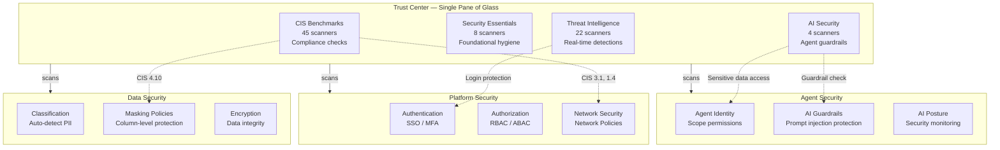
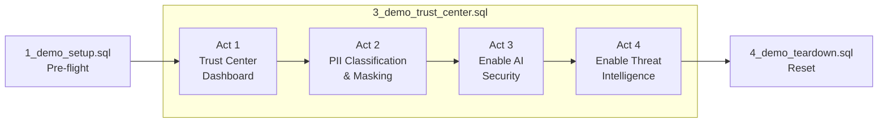

# Trust Center Demo — SWT London 2026

**Innovate at Scale: Powering a Secure and Resilient AI Estate**

A live demo showcasing Snowflake Trust Center across four security domains: CIS Benchmarks, PII classification and masking, AI Security, and Threat Intelligence.

## Architecture

## Files

Run in this order:

| # | File | Purpose |
|---|------|---------|
| 1 | [1_demo_setup.sql](1_demo_setup.sql) | **Pre-flight.** Run before the talk to set the account to the correct starting state. |
| 2 | [2_demo_walkthrough.md](2_demo_walkthrough.md) | **Reference guide.** Step-by-step Snowsight UI navigation with talk track. |
| 3 | [3_demo_trust_center.sql](3_demo_trust_center.sql) | **Main demo.** Open in a Snowsight worksheet and step through the 4 acts on stage. |
| 4 | [4_demo_teardown.sql](4_demo_teardown.sql) | **Cleanup.** Run after the talk to reset state so the demo is repeatable. |
| 5 | [5_demo_violations_setup.sql](5_demo_violations_setup.sql) | **Violations.** Creates demo users, agents, disables guardrails to populate all Trust Center tabs. |
| 6 | [6_demo_violations_teardown.sql](6_demo_violations_teardown.sql) | **Violations cleanup.** Drops demo objects, re-enables guardrails, resets state. |

## Demo Flow (~8 minutes)

| Act | Topic | What Happens |
|-----|-------|--------------|
| 1 | Single Pane of Glass | Open Trust Center, show CIS findings (critical network policy gap, admin-privileged tasks) |
| 2 | PII Classification and Data Protection | Auto-classify HR data, apply tags, show masking policies in action |
| 3 | Agent Security | Enable AI Security live, run scanners for prompt injection, agent data access |
| 4 | Threat Detection | Enable Threat Intelligence live, show login protection and auth failure detection |

## Prerequisites

- Snowflake account with ACCOUNTADMIN access
- Trust Center available (CIS Benchmarks and Security Essentials enabled)
- `DEMO_DB.PUBLIC.HR_DATA` table with PII columns
- `RBAC_DEMO_DB.ANALYST_DATA.STOCK_ANALYST_DATA` table with masking policies

## Links

- [Snowflake Trust Center Documentation](https://docs.snowflake.com/en/user-guide/trust-center)
- [CIS Snowflake Benchmark](https://docs.snowflake.com/en/user-guide/trust-center-cis)
- [Data Classification](https://docs.snowflake.com/en/user-guide/governance-classify-concepts)
- [Dynamic Data Masking](https://docs.snowflake.com/en/user-guide/security-column-ddm-intro)
- [Cortex AI Guardrails](https://docs.snowflake.com/en/user-guide/snowflake-cortex/cortex-guard)
