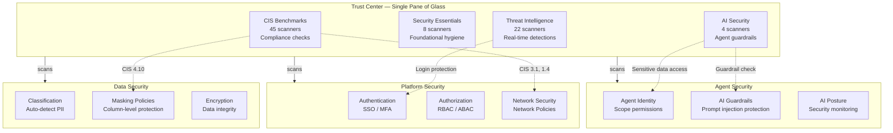
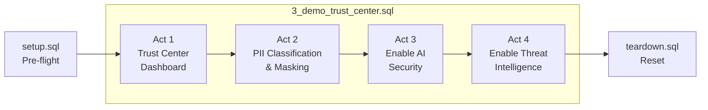

# Trust Center Demo — SWT London 2026

**Innovate at Scale: Powering a Secure and Resilient AI Estate**

A live demo showcasing Snowflake Trust Center across four security domains: CIS Benchmarks, PII classification and masking, AI Security, and Threat Intelligence.

## Architecture

## Files

| File | Purpose |
|------|---------|
| [setup.sql](setup.sql) | **Run before the talk.** Creates demo objects, populates all Trust Center tabs, invokes agents for detections. |
| [demo.sql](3_demo_trust_center.sql) | **Main demo.** Open in a Snowsight worksheet and step through the 4 acts on stage. |
| [teardown.sql](teardown.sql) | **Run after the talk.** Drops all demo objects and resets state so the demo is repeatable. |

## Demo Flow (~8 minutes)

| Act | Topic | What Happens |
|-----|-------|--------------|
| 1 | Single Pane of Glass | Open Trust Center, show CIS findings (critical network policy gap, admin-privileged tasks) |
| 2 | PII Classification and Data Protection | Auto-classify HR data, apply tags, show masking policies in action |
| 3 | Agent Security | Enable AI Security live, run scanners for prompt injection, agent data access |
| 4 | Threat Detection | Enable Threat Intelligence live, show login protection and auth failure detection |

## Prerequisites

- Snowflake account with ACCOUNTADMIN access
- Trust Center available (CIS Benchmarks and Security Essentials enabled)
- `DEMO_DB.PUBLIC.HR_DATA` table with PII columns
- `RBAC_DEMO_DB.ANALYST_DATA.STOCK_ANALYST_DATA` table with masking policies

## Timing

Run `setup.sql` **at least 2 hours before** going on stage. The agent invocations at the end of setup generate access history events that need ~2 hours to propagate before the AI Security detection scanner can pick them up.

---

## Snowsight UI Walkthrough

### Before You Begin

- Open two tabs in Snowsight:
  1. **Trust Center** (Monitoring > Trust Center)
  2. **SQL Worksheet** with `3_demo_trust_center.sql` loaded
- Ensure you are using **ACCOUNTADMIN** role
- Increase font size in Snowsight for readability (Cmd/Ctrl + Plus)

---

### Act 1: The Single Pane of Glass (~2 min)

#### Step 1: Trust Center Dashboard

1. **Navigate** to Trust Center: Monitoring > Trust Center
2. **Point out the overview:**
   - Severity badges at the top — Critical, High, Medium, Low counts
   - Scanner packages listed: CIS Benchmarks (enabled), Security Essentials (enabled)
   - AI Security and Threat Intelligence are listed but **not enabled** — say: "We'll come back to these"
3. **Talk track:** "This is Trust Center — Snowflake's single pane of glass for security, compliance, and governance. It scans your account against industry benchmarks and surfaces exactly what needs attention."

#### Step 1.5: Security Posture and Coverage

1. **Switch to SQL worksheet**, run the scanner coverage query
2. **Point out:** 100% coverage across all 4 packages — 72 scanners active
3. **Talk track:** "This is your security posture baseline. Coverage tells us how much of the security surface we're actually monitoring. 100% means no blind spots."

#### Step 2: Drill into CIS 3.1 (Critical)

1. **Click** on the CIS Benchmarks package
2. **Find and click** CIS 3.1 — "Ensure that all users are covered by a network policy"
3. **Show:**
   - Severity: **Critical**
   - At-risk entities count
   - Suggested action: The exact SQL to create a network rule and policy
4. **Talk track:** "Trust Center doesn't just flag this — it gives you the exact SQL to fix it."

#### Step 3: Show High Findings (Tasks with Admin Roles)

1. **Navigate back** to CIS Benchmarks findings list
2. **Point out** CIS 1.14 and 1.15 — "Tasks owned by / running with ACCOUNTADMIN"
3. **Talk track:** "41 tasks running with ACCOUNTADMIN privileges. In the agentic world, this is exactly the over-privileged access pattern that creates risk."

---

### Act 2: PII Classification and Data Protection (~2 min)

#### Step 4: Show the HR Data

1. Run `SELECT * FROM DEMO_DB.PUBLIC.HR_DATA LIMIT 5;`
2. **Talk track:** "Here's an HR table — names, emails, ages. Let's ask Snowflake to classify what's in it."

#### Step 5: Run Auto-Classification

1. Run `SELECT EXTRACT_SEMANTIC_CATEGORIES('DEMO_DB.PUBLIC.HR_DATA');`
2. **Click on the result** to expand the JSON — EMAIL_ADDRESS, FNAME/LNAME, AGE all identified
3. **Talk track:** "Snowflake has automatically identified the semantic categories — no manual tagging needed."

#### Step 6: Apply Tags

1. Run `CALL ASSOCIATE_SEMANTIC_CATEGORY_TAGS(...)` 
2. **Talk track:** "Tags applied. Every column now has a semantic category and privacy classification."

#### Step 7: Show Masking in Action

1. Run the STOCK_ANALYST_DATA query as ACCOUNTADMIN — full visibility
2. **Talk track:** "As an admin, I see everything. But when a restricted role queries the same table, masking policies automatically redact the sensitive fields."

#### Step 8: Data Security Tab

1. **Navigate** to Trust Center > **Data Security** tab > **Dashboard**
2. **Point out:** Objects that need review, unmasked sensitive columns, classification categories chart
3. **Talk track:** "Snowflake automatically classified our databases. We can see exactly which objects contain sensitive data and which columns still need masking."

---

### Act 3: Agent Security — Enable Live (~2 min)

#### Step 9: Enable AI Security (The Live Moment)

1. Show AI Security state is FALSE
2. Run `CALL snowflake.trust_center.set_configuration('ENABLED', 'TRUE', 'AI_SECURITY', false);`
3. **Talk track:** "One command. That's all it takes."

#### Step 10: Show What AI Security Checks

Walk through each scanner:
- Cortex AI Guardrails — prompt injection protection
- Sensitive Data Accessed by Agent — data exfiltration risk
- Cortex Search Service Privileged Roles — least privilege
- Cortex Code PAT Usage — role restriction and network policy

#### Step 11: Run AI Security Scanners

1. Run `CALL snowflake.trust_center.execute_scanner('AI_SECURITY');`
2. Query findings — show results

---

### Act 4: Threat Detection (~2 min)

#### Step 12: Enable Threat Intelligence

1. Run `CALL snowflake.trust_center.set_configuration('ENABLED', 'TRUE', 'THREAT_INTELLIGENCE', false);`
2. Show the 18 detection scanners grouped by category:
   - **Identity & Auth:** Login Protection, Dormant User Login, High Auth Failures, MFA Readiness
   - **Privilege Monitoring:** MANAGE GRANTS, Admin Privilege Grants
   - **Anomaly Detection:** Unusual app sessions, long-running queries, high job failures
   - **Data & Config Protection:** Sensitive Parameter Protection, Share Exposure, policy changes

#### Step 13: Run and Show Full Posture

1. Run `CALL snowflake.trust_center.execute_scanner('THREAT_INTELLIGENCE');`
2. Run the closing posture summary query
3. **Talk track:** "Four packages. All enabled. Full coverage. This is your security posture at a glance — proactive, enterprise-grade security for data and AI. Built in, not bolted on."

---

### Closing

- **Switch back to slides** — Slide 7: THANK YOU

---

## Troubleshooting

| Issue | Fix |
|-------|-----|
| Scanner package won't enable | Check you're using ACCOUNTADMIN or a role with `trust_center_admin` |
| `execute_scanner` returns no findings | This is fine — it means no issues found. Emphasise "clean bill of health" |
| Classification returns unexpected results | The JSON output is still demo-worthy — focus on auto-detected categories |
| Masking demo fails | Ensure RBAC_DEMO_DB policies are attached. Run `DESCRIBE TABLE` to verify |
| Trust Center UI not loading | Refresh the page. Ensure you're on a supported browser |
| AI Security detections not showing | Agent invocations need ~2 hours to appear in access history. Run setup earlier. |

## Links

- [Snowflake Trust Center Documentation](https://docs.snowflake.com/en/user-guide/trust-center)
- [CIS Snowflake Benchmark](https://docs.snowflake.com/en/user-guide/trust-center-cis)
- [Data Classification](https://docs.snowflake.com/en/user-guide/governance-classify-concepts)
- [Dynamic Data Masking](https://docs.snowflake.com/en/user-guide/security-column-ddm-intro)
- [Cortex AI Guardrails](https://docs.snowflake.com/en/user-guide/snowflake-cortex/cortex-guard)
